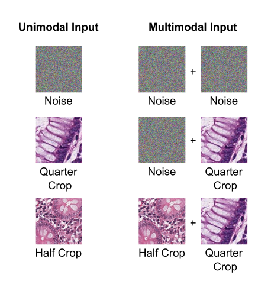

# MultiStainDeepLearning
This is the GitHub Repository providing an example code base for **"The AImmunoscore – Multistain deep learning for prediction of prognosis and therapy response in colorectal cancer"** by Foersch et al. (and other projects using multiple input data). The underlying study is a proof of concept and has not been evaluated in a clinical context. The content of this repo (including the code, the example data, the repo license, etc.) may be subject to change in the future. For further questions feel free to inquire about this project to our group [here](mailto:sebastian.foersch@unimedizin-mainz.de?subject=[GitHub]Multi%20Stain%20Deep%20Learning).

## Getting started

### Dependencies
This project requires Python 3 (3.6.9) with the following additional packages:
* [PyTorch](https://pytorch.org/) (torch==1.9.0, torchvision==0.10.0) with CUDA support
* [NumPy](https://numpy.org/) (1.18.1)
* [tqdm](https://github.com/tqdm/tqdm) (4.64.0)
* [lifelines](https://github.com/CamDavidsonPilon/lifelines) (0.25.7)
* [scikit-learn](https://scikit-learn.org/stable/) (0.24.2)
* [matplotlib](https://matplotlib.org/) (3.3.4)
* [pandas](https://pandas.pydata.org/) (0.24.2)
* [TensorBoard](https://pypi.org/project/tensorboard/) (2.1.0)
* [Pillow](https://pypi.org/project/Pillow/) (7.1.2)
* [Captum](https://captum.ai/) (0.4.0)

The numbers in parentheses denote the versions used during development of this project. Other python and package versions may or may not work as intended.

[//]: # (A requirements file is provided in the root of this project and can be used to install the required packages via `pip install -r /path/to/requirements.txt`. If the process fails, you may need to upgrade setuptools via `pip install --upgrade setuptools`.)

### General usage
Using a preexisting configuration .json file, start training via `python train.py -c path/to/your_config.json`. Any resulting training logs and model checkpoints will be placed in a timestamped folder at the location specified in the config file (this location does not need to exist yet).

Evaluate your model checkpoint by running `python test.py -r <save_location>/models/your_checkpoint.pth`. The results are placed into a timestamped folder at the location specified by `<save_location>/config.json`.

If you have multiple GPUs and want to utilize GPU number i, append `-d i` to either of these commands.

TensorBoard can be used for monitoring the training process. To do so, ensure that
```
"tensorboard" : true
 ```
is set in the config file. Recorded data can then be viewed via `tensorboard --logdir /path/to/save_directory`. TensorBoard recursively accesses all logs contained within the specified directory.

### Try it with example data
To get you started, example data and configuration files are provided. The data can be downloaded from [here](https://zenodo.org/record/6791937). Extract `data.zip` and place the contents into the `data` folder like this:
```
data/
|
|---- half_crop/
|---- half_crop_noise/
|---- quarter_crop/
|---- quarter_crop_noise/
```

Each of the data folders corresponds to one modality, i.e. one possible kind of input image type for a multimodal model. The half_crop and quarter_crop folders contain images of healthy ("Normal") or cancerous ("Tumor") colonic mucosa tissue. The noise folders contain images filled with uniform noise, but labeled in the same way as the actual images (see the files describing the data in `config/csv`). Please note that this is not the data set used in our publication. However, it serves to demonstrate that both unimodal and multimodal models trained solely on noise will not learn anything meaningful, while adding real histopathological image data improves the models' performance.



In the `config` folder, we provide configuration files for training unimodal models on each of these modalities, as well as multimodal models on the following combinations:
* half and quarter
* half_noise and quarter
* half_noise and quarter_noise

We also provide pretrained model checkpoints for each of these configurations [here](https://zenodo.org/record/6791937). To use these with the provided config files, extract `saved.zip` and place the contents into the `saved` folder like this:
```
saved/
|
|---- multimodal_half_noise_quarter
|---- multimodal_half_noise_quarter_noise
|---- multimodal_half_quarter
|---- unimodal_half
|---- unimodal_half_noise
|---- unimodal_quarter
|---- unimodal_quarter_noise
```


#### Unimodal training
To train a unimodal model, simply run `python train.py -c config/<some_unimodal_config>.json` for one of the unimodal config files. 


#### Multimodal training
To train a multimodal model, ensure you have a unimodal checkpoint file for each relevant modality. While we provide unimodal checkpoints for this example, in general you will need to first train these yourself. You may want to replace the checkpoint paths under the `"lo_pretrained"` key in the multimodal configurations with your own unimodal checkpoints. Then, simply run `python train.py -c config/<some_multimodal_config>.json`


### Use your own data
To train on other data and classification tasks, you will need to create your own .csv files describing the data and .json files describing the configuration. To get started, read the following description and/or take a look at the example files in the `config` folder.


#### Data description (.csv)
Each modality requires at least two .csv description files (one for training, one for validation) structured like so:

| Patient_ID | Path                 | Label | Set   |
|------------|----------------------|-------|-------|
| pid0       | path/to/pid0_0.jpg   | A     | TRAIN |
| pid0       | path/to/pid0_1.jpg   | A     | TRAIN |
| ...        | ...                  | ...   | ...   |
| pid999     | path/to/pid999_0.jpg | B     | TRAIN |
| pid999     | path/to/pid999_1.jpg | B     | TRAIN |

Some notes:
* All entries using the same Patient_ID must share the same label.
* The .csv file for the training data needs each entry to have the value `TRAIN` in the `Set` column. The files for validation or testing need to have the value `VALID` in the `Set` column.
* The `Patient_ID`, `Path` and `Set` column names must exist exactly with this spelling. The `Label` column, on the other hand, can be named however you like and the labels themselves can have whatever names you like (just be consistent, of course).
* If you specify the `data_root` value in your configuration files, the paths in the `Path` column will be treated as relative to that.

For each multimodal model, you will additionally need a validation .csv file structured like this:

| Patient_ID | Label | Set   | Modality0_Path            | Modality1_Path            | Modality2_Path            | ... |
|------------|-------|-------|---------------------------|---------------------------|---------------------------|-----|
| pid0       | A     | VALID | path/to/pid0_mod0_0.jpg   | path/to/pid0_mod1_0.jpg   | path/to/pid0_mod2_0.jpg   | ... |
| pid0       | A     | VALID | path/to/pid0_mod0_1.jpg   | path/to/pid0_mod1_1.jpg   | path/to/pid0_mod2_0.jpg   | ... |
| ...        | ...   | ...   | ...                       | ...                       | ...                       | ... |
| pid999     | B     | VALID | path/to/pid999_mod0_0.jpg | path/to/pid999_mod1_0.jpg | path/to/pid999_mod2_0.jpg | ... |
| pid999     | B     | VALID | path/to/pid999_mod0_1.jpg | path/to/pid999_mod1_1.jpg | path/to/pid999_mod2_1.jpg | ... |

Some notes:
* The same restrictions regarding the columns `Patient_ID`, `Label` and `Set` as above apply.
* The columns for each of the modality paths can be named however you like. The paths are again relative to the `data_root` value in your configuration files.
* This file is not needed for the training data because combinations are randomly drawn during training.


#### Configuration (.json)
The configuration .json files that describe model training and evaluation are structured as follows (minus the comments):
```json
{
    "name": "some_multimodal_setup",                                                            // Experiment name, will be appended to save_dir (see trainer).
    "n_gpu": 1,                                                                                 // Number of GPUs, should stay at 1.

    "arch": {
        "type": "MultiModel",                                                                   // Model architecture class name. Both uni- and multimodal training uses this class.
        "args": {
          "num_classes": 2,                                                                     // Number of classes, should be >= 2.
          "lo_dims": [32,32,32],                                                                // Number of output features for each unimodal model.
                                                                                                // --> Only one entry for unimodal training.
          "lo_pretrained": [                                                                    // Paths to the pretrained unimodal models. Omit this entry for unimodal training.
            "./saved/path/to/checkpoint/for/modality0.pth",
            "./saved/path/to/checkpoint/for/modality1.pth",
            "./saved/path/to/checkpoint/for/modality2.pth"
          ],
          "mmhid": 64,                                                                          // Input size for the final classification layer.
          "dropout_rate": 0.3,                                                                  // Dropout rate only applies during multimodal training.
          "genomic": false                                                                      // Leave this at false.
        }
    },
    "data_loader": {
        "type": "BasicMixDataLoader",                                                           // Data loader class name.
        "args":{
          "data_root": ".data/",                                                                // Prefix for all paths in the data description .csv files.
          "dataframes": [                                                                       // Paths to .csv files describing the training data, one for each modality in use.
            "./config/csv/training_dataframe_for_modality0.csv",                                // --> Only one entry during unimodal training.
            "./config/csv/training_dataframe_for_modality1.csv",
            "./config/csv/training_dataframe_for_modality2.csv"
          ],
          "labels": ["Tumor_Label"],                                                            // Name of the label column in your .csv files
          "dataframe_valid": "./config/csv/multimodal_val.csv",                                 // Path to data description used for validation/early stopping.
                                                                                                // These are different files for the unimodal and multimodal cases, see the previous section.
          "valid_columns": ["modality0_Path", "modality1_Path", "modality2_Path"],              // Name of the columns containing the paths for each modality.
                                                                                                // In the unimodal case, the list contains only "Path".
          "shuffle": true,                                                                      // data shuffling only applies to training data.
          "num_workers": 8,
          "batch_size": 64                                                                      // One dataset element contains one image from every modality in use
                                                                                                // --> Batches take up more memory during multimodal training.
       }
  },
    "transformations":{
      "type": "ImageAugmentation",                                                              // See datahandler/transforms/data_transforms.py for possible options.
      "args": {
        "size": 224,
        "normalization": [[0.485, 0.456, 0.406], [0.229, 0.224, 0.225]]
      }
    },
    "optimizer": {                                                                              // Accepts any optimizer from torch.optim along with its arguments.
        "type": "Adam",
        "args":{
            "lr": 0.000003
        }
    },
    "loss": {                                                                                   
        "type": "CrossEntropyLoss",
        "args": {
        }
    },

    "metrics": {                                                                                // Metrics to track during training.
      "epoch": [
        {
          "type":  "accuracy_epoch",
          "args":  {}
      }
    ],
      "running": []
    },
    "trainer": {
        "type": "BasicMultiTrainer",
        "args": {},
        "epochs": 1000,                                                                         // Number of epochs to train for.
        "save_dir": "saved/",                                                                   // Prefix for the save directory (see "name" key)
        "save_period": 10,                                                                      // Save a model checkpoint every x epochs.
        "val_period": 1,                                                                        // Validate model every x epochs, save a checkpoint if best performance yet.
        "verbosity": 2,                                                                         // Between 0 and 2. 0 is least verbose, 2 most.
        "freeze": true,                                                                         // Freeze unimodal models during multimodal training?
        "unfreeze_after": 50,                                                                   // If freeze is true, unfreeze unimodal models after this many epochs.
        "monitor": ["max val_accuracy_epoch", "min val_loss_epoch"],                            // Metrics to monitor for determining best performance.
        "tensorboard": true,                                                                    // Track training with TensorBoard?
        "evaluation": true                                                                      // Evaluate model performance on validation data when finished with training?
    }
}
```

The above is an example of a multimodal configuration. Unimodal configurations are structured the same unless noted otherwise in the comments.


## Contact
Dr. Sebastian Foersch  
Institute of Pathology  
University Medical Center Mainz  
Langenbeckstr. 1  
55131 Mainz, Germany


## How to cite
The reference on how to cite the paper will appear here after acceptance.


## License
This project is licensed under the GNU GPLv3 license - see the COPYING file for details.


## Acknowledgements
This project's structure is based on the [PyTorch Template Project](https://github.com/victoresque/pytorch-template) by Victor Huang, licensed under the MIT License - see LICENSE-3RD-PARTY for details.